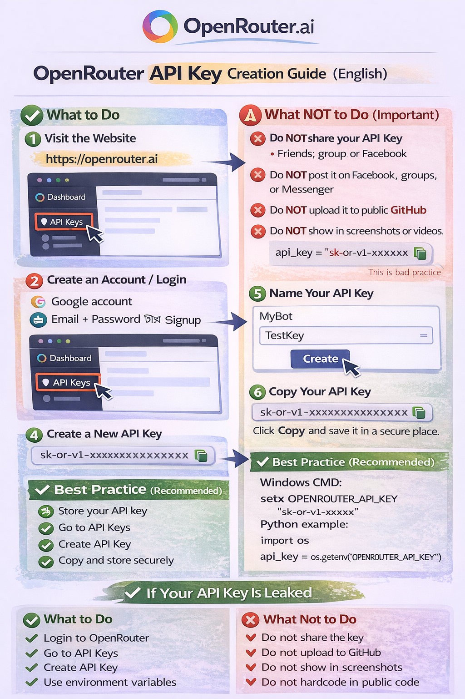

# Shizuka AI Assistant

Shizuka AI Assistant is a Voice and Text based Personal AI Assistant
designed to help you perform daily tasks easily on your computer.

Developed by **Abu Tanim (Mr. Tan)**

------------------------------------------------------------------------

## ✅ Features

-   Voice & text commands\
-   AI chat system\
-   Reminder & notes\
-   System control\
-   WhatsApp automation\
-   Image generation\
-   Learning memory\
-   Fun & motivation

------------------------------------------------------------------------

## ⚙️ First Time Setup

### 1️⃣ OpenRouter API Key

On first run, the program will open:

    https://openrouter.ai

Steps: 1. Create an account 2. Generate API key 3. Paste it into the
program 4. Press Enter

Saved in:

    configa.json
    

------------------------------------------------------------------------

### 2️⃣ Microphone Permission

Allow microphone access for voice commands.

------------------------------------------------------------------------

### 3️⃣ Screen Coordinate Setup

For call end feature:

    Set your screen Width value:
    Set your screen Height value:

------------------------------------------------------------------------

## 🗣️ Full Command List

### ⏰ Time & Date

-   What time is it
-   What is today's date

### 🧠 AI Chat

-   What is \[question\]
-   Tell me about \[topic\]
-   Calculate \[math\]
-   Motivate me
-   Tell me a fun fact

### 📝 Learning

-   Remember that sky is blue
-   What is sky
-   What have you learned

### ⏳ Reminder

-   Set reminder
-   Remind me

Time format: - 2 30 PM - 10 AM - 7 PM - 14 45

### 📝 Notes

-   Take note
-   Save note
-   Read notes
-   Show notes

### 🎨 Image

-   Generate image
-   Create image
-   Draw image

### 💻 System Info

-   System info
-   Battery status
-   CPU usage

### 📸 Screenshot

-   Take screenshot

### 🔊 Volume & Brightness

-   Volume up
-   Volume down
-   Mute
-   Increase brightness
-   Decrease brightness

### 🌐 Open Websites

-   Open Google
-   Open YouTube
-   Open Facebook
-   Open GitHub
-   Open ChatGPT
-   Open Gemini
-   Open background remover

### 📱 WhatsApp

-   Open WhatsApp
-   Close WhatsApp
-   Send message to \[name\]
-   Send whatsapp to \[name\]
-   Call \[name\]
-   End call

### 💻 Apps

-   Open calculator
-   Close calculator
-   Open notepad
-   Close notepad
-   Open settings
-   Close settings
-   Open command prompt
-   Close command prompt

### 🧹 System Control

-   Minimize all windows
-   Empty recycle bin
-   Shutdown PC
-   Restart PC

### 🎵 Entertainment

-   Play \[song name\]
-   Roll dice
-   Flip a coin
-   Random number

### 🌐 Search

-   Search for \[topic\]
-   Google search \[topic\]

### ❌ Exit

-   Goodbye
-   Stop
-   Bye

------------------------------------------------------------------------

## 📁 Files Created Automatically

-   configa.json → API key\
-   screen_config.txt → Screen coordinates\
-   reminders.json → Reminders\
-   voice_notes.txt → Notes\
-   learning_data.json → Memory\
-   conversation_history.json → Chat history

------------------------------------------------------------------------

## ⚠️ Important Notes

-   Internet connection required\
-   WhatsApp Desktop required\
-   Microphone required\
-   Windows OS recommended\
-   Antivirus may block EXE --- allow it

------------------------------------------------------------------------

## ❌ Source Code Policy

This software is provided as an executable (.exe) only.\
Source code sharing is not allowed.

------------------------------------------------------------------------

## 👨‍💻 Developer

Developed by: **Abu Tanim (Mr. Tan)**\
GitHub: https://github.com/mrtan-official

------------------------------------------------------------------------

## ❤️ Thank You

Thank you for using **Shizuka AI Assistant**.\
Enjoy your smart assistant!
