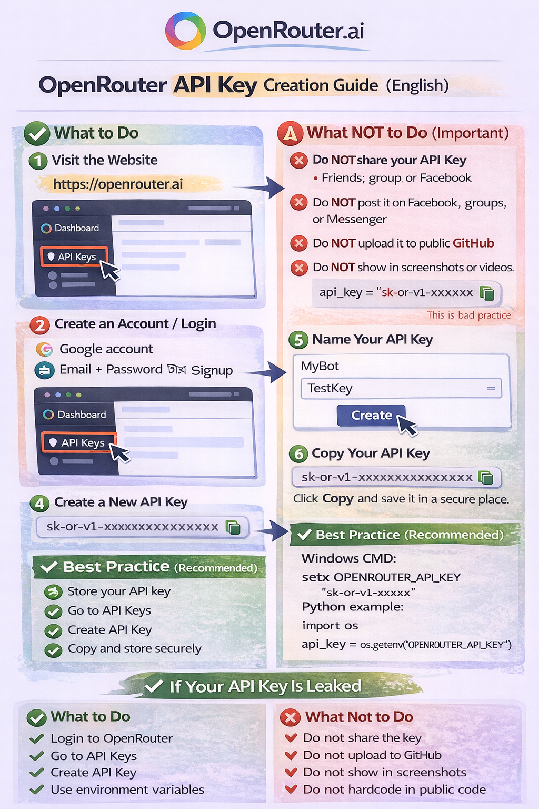

# Shizuka AI Assistant

Shizuka AI Assistant is a Voice and Text based Personal AI Assistant  
designed to help you perform daily tasks easily — available on **Windows** and **Android**.

Developed by **Abu Tanim (Mr. Tan)**

---

## 📦 Versions

| Platform | Type | Status |
|----------|------|--------|
| 🖥️ Windows | `.exe` Desktop App | ✅ Available |
| 📱 Android | `.apk` Mobile App | ✅ Available (v2.1) |

---

## 📱 Android Version — v2.1

### ✅ Features
- AI Chat (text-based)
- Bangla / multilingual support
- Reminders & Notes
- WhatsApp quick message
- File upload & AI analysis
- Auto update notification
- Encrypted conversation history

### 📥 Install
Download `Shizuka-v2.1.apk` from [Releases](https://github.com/mrtan-official/Shizuka/releases)

> ⚠️ Allow "Install from unknown sources" in Android settings

### ⚙️ Setup
1. Open app → go to **Settings**
2. Enter your [OpenRouter API Key](https://openrouter.ai)
3. Tap **Save** — done!

### 📁 File Upload (New in v2.1)
- Tap **File** button in Chat
- Android file picker opens directly
- Select any `.txt`, `.py`, `.json`, `.md`, `.csv`, `.html` file
- Shizuka will analyze it automatically

### 🌐 Language Support
- Write in **Bangla** → reply in Bangla
- Write in Hindi, Arabic, English → reply in same language
- AI auto-detects your language

### 🔔 Auto Update
- App checks for new version on startup
- Yellow banner appears on home screen if update available
- Settings → **Check for Updates** anytime

### Requirements
- Android 6.0+ (API 23)
- Internet connection
- OpenRouter API Key (free available)

---

## 🖥️ Windows Version

### ✅ Features
- Voice & text commands
- AI chat system
- Reminder & notes
- System control
- WhatsApp automation
- Image generation
- Learning memory
- Fun & motivation

### 📥 Install
Download `Shizuka-AI.exe` from [Releases](https://github.com/mrtan-official/Shizuka/releases)

> ⚠️ Antivirus may block EXE — allow it manually

### ⚙️ First Time Setup

**1️⃣ OpenRouter API Key**

On first run, the program will open `https://openrouter.ai`

Steps:
1. Create an account
2. Generate API key
3. Paste it into the program
4. Press Enter

Saved in: `configa.json`



**2️⃣ Microphone Permission**

Allow microphone access for voice commands.

**3️⃣ Screen Coordinate Setup**

For call end feature:
```
Set your screen Width value:
Set your screen Height value:
```

### 🗣️ Full Command List

#### ⏰ Time & Date
- What time is it
- What is today's date

#### 🧠 AI Chat
- What is [question]
- Tell me about [topic]
- Calculate [math]
- Motivate me
- Tell me a fun fact

#### 📝 Learning
- Remember that sky is blue
- What is sky
- What have you learned

#### ⏳ Reminder
- Set reminder
- Remind me

Time format:
- `2 30 PM`
- `10 AM`
- `7 PM`
- `14 45`

#### 📝 Notes
- Take note / Save note
- Read notes / Show notes

#### 🎨 Image
- Generate image
- Create image
- Draw image

#### 💻 System Info
- System info
- Battery status
- CPU usage

#### 📸 Screenshot
- Take screenshot

#### 🔊 Volume & Brightness
- Volume up / Volume down / Mute
- Increase brightness / Decrease brightness

#### 🌐 Open Websites
- Open Google / YouTube / Facebook / GitHub
- Open ChatGPT / Gemini
- Open background remover

#### 📱 WhatsApp
- Open WhatsApp / Close WhatsApp
- Send message to [name]
- Send whatsapp to [name]
- Call [name] / End call

#### 💻 Apps
- Open/Close calculator
- Open/Close notepad
- Open/Close settings
- Open/Close command prompt

#### 🧹 System Control
- Minimize all windows
- Empty recycle bin
- Shutdown PC / Restart PC

#### 🎵 Entertainment
- Play [song name]
- Roll dice / Flip a coin / Random number

#### 🌐 Search
- Search for [topic]
- Google search [topic]

#### ❌ Exit
- Goodbye / Stop / Bye

### 📁 Files Created Automatically
| File | Purpose |
|------|---------|
| `configa.json` | API key |
| `screen_config.txt` | Screen coordinates |
| `reminders.json` | Reminders |
| `voice_notes.txt` | Notes |
| `learning_data.json` | Memory |
| `conversation_history.json` | Chat history |

### ⚠️ Important Notes
- Internet connection required
- WhatsApp Desktop required
- Microphone required
- Windows OS recommended
- Antivirus may block EXE — allow it

---

## 🔑 API Key — Both Versions

1. Go to [openrouter.ai](https://openrouter.ai)
2. Create a free account
3. Copy your API key
4. Paste it in the app (Windows: on first run / Android: Settings)

Free models available — no payment required for basic use.

---

## ❌ Source Code Policy

This software is provided as executable files only (`.exe` / `.apk`).  
Source code sharing is not allowed.

---

## 👨‍💻 Developer

Developed by: **Abu Tanim (Mr. Tan)**  
GitHub: [github.com/mrtan-official](https://github.com/mrtan-official)  
Repo: [github.com/mrtan-official/Shizuka](https://github.com/mrtan-official/Shizuka)

---

## ❤️ Thank You

Thank you for using **Shizuka AI Assistant**.  
Enjoy your smart assistant — on your PC and in your pocket!
